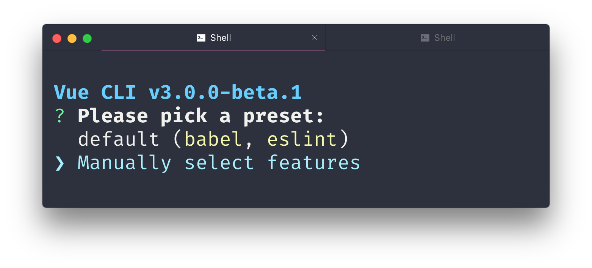
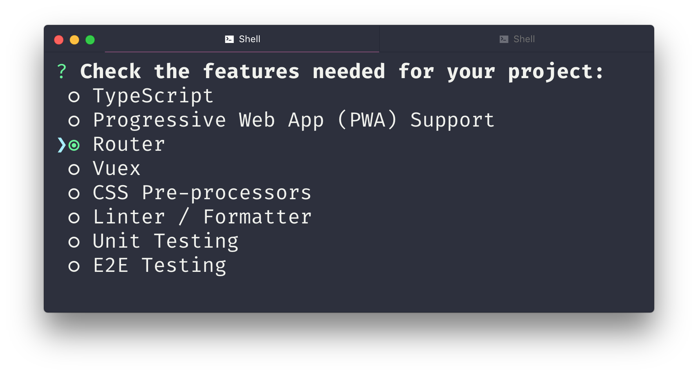

# discogs-vue

The goal of this exercise is to try out the vue-cli tool and work with Single File Components.
We will make you create and use a lot of components to help you get comfortable with them.
Also, we will keep using vue-router and Bulma.

The instructions will be sparse. We want you to figure out which step to undertake.


## The product

The final product should be an applicaton that allows you to search for an artist.
The result of the search will be a collection of artists that match your input.
Each result should provide a link to a specific page for the artist.
On such a page you should be able to see the list of albums and, for each album, the list of tracks.

This is very reminiscent of the Spotify exercise of Module 2.
We will actually be reimplementing a lot of those functionalities but this time with the [Discogs API](https://www.discogs.com/developers/) and Vue.js.

## The setup

### The project

Install the vue-cli tool globally if you haven't already:

```bash
$ npm install -g @vue/cli
```

Then, generate a new project by typing:

```bash
$ vue create lab-vue-discogs
```

Make sure to select _Manually select features_ and then to press _Space_ to select _Router_ and follow up with the _Enter_ key. The rest of the answers doesn't matter.





Once it's finished it will tell you what to do, you will have to get into the folder and run `npm run serve`. The browser window will open alone.

### The API

#### Discogs Token

Create a [Discogs Account](https://www.discogs.com/users/create) if you don't have one already. Then go to the [developer panel](https://www.discogs.com/settings/developers) and click on the *Generate new token* button. Copy-paste the string that appears in a file; you will need it later.

#### API wrapper

To call the API we will need axios. Let's install it.

```
npm install axios
```

We will then need to create an `api.js` file to wrap the API.
The [Discogs API](https://www.discogs.com/developers/) requires you to set your user agent to something unique. We show you below how to do this; just remember to replace *YourDiscorgsAccountName* with your actual account name and *YourToken* with the token you generated just before.

```
// src/api.js
import axios from 'axios'

const discogs = axios.create({
  baseURL: "https://api.discogs.com",
  httpAgent: "Ironhack Paris YourDiscogsAccountName/1.0 +http://localhost",
  params: {
    token: "YourToken"
  }
})
```

You now use the axios methods using the `discogs` object.

### Bulma

We are going to include Bulma to make styling easier. This time, instead of using a CDN, we will leverage Webpack.

First, we need to install bulma; let's do `npm install bulma`.
Then, we want to import it. In the file `src/main.js`, please include towards the top of the file the following line:

```
// src/main.js
import Vue from 'vue'
import 'bulma/css/bulma.css' // this is the line you need to add
import App from './App'
import router from './router'

Vue.config.productionTip = false

// rest of the file
```

## Requirements

### The routes

We want you to have at least the following routes:

- `/` should display a homepage with a search bar.
- `/artists/:id` should display the page for a specific artist.

### The components

We will require you to create **a lot** of components; at least the following:

- `HomePage`: a component for the homepage.
- `ArtistPage`: a component for the page specific to an artist.
- `NavBar`: a navbar that should appear on every page. Just put a single link toward the homepage in it.
- `SearchBar`: a search bar that will search for an artist and display the results as thumbnails.
- `ArtistThumbnail`: a component to display a thumbnail with the picture of an artist and a link to the artist page.
- `AlbumCard`: a component that displays the cover and the title of an album, as well as the list of tracks.
- `TrackPreview`: a component with the title of a track and an audio tag to listen to the preview.
